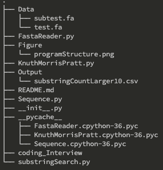
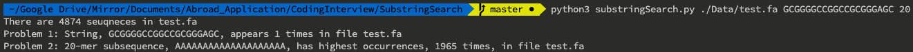

# Coding interview

## Questions

**Please write a simple program to perform the following tasks:** 

1. Calculate the #occurrence for a given 20-mer subsequence GCGGGGCCGGCCGCGGGAGC
2. Find the 20-mer subsequence with the highest occurrences.

## Usage

```shell
# python3 ./substringSearch.py data substring n-mer
python3 ./substringSearch.py ./Data/test.fa GCGGGGCCGGCCGCGGGAGC 20
```

## Files Structure



**substringSearch.py** is program's entry point.

**FastaReader.py** is a class for reading fasta file and helping calculating the highest occurrences of 20-mer subsequences as well as #occurrence for a given 20-mer subsequence in the fasta file. (Problem 2 is answered in this file's `findHighestOccurrence()` function)

**KnuthMorrisPratt.py** is a class which implements the Knuth-Morris-Pratt algorithm for substring searching (Problem 1's answer).

**Sequence.py** is a class for reading sequence information.

**Output/substringCountLarger10.csv** is a csv file which contains substrings and their count. (Only preserve the substring which counts are larger than 10)


## Results



**Problem 1.**
GCGGGGCCGGCCGCGGGAGC only appears *1* time.

**Problem 2.**
*AAAAAAAAAAAAAAAAAAAA* has highest occurrences about 1965 times.


### Explanation of my solution

**Problem 2.**

*Advantage* - 
Because of Python, its dictionary is implemented by hashTable. Therefore, I assume that the complexity of searching value by key is O(1).  And the complexity of string splicing is also O(1). 


*Disadvantage* - 
This algorithm occupys large amout of memory, because it stores all substring results.


## Programs

##### substringSearch.py

```py
import sys, os
from FastaReader import FastaReader  
from collections import defaultdict

def main():
    fastaDir = os.path.abspath(sys.argv[1])  # file directory
    fastaReader = FastaReader()
    fastaReader.readFastaFile(fastaDir)     # read file
    
    # PROBLEM 1. (Detail Algorithm implemented in Sequence.py (subStringSearch() function))
    searchString = sys.argv[2]
    numOfSubstring = fastaReader.numberOfSubstring(searchString)
    print(f"Problem 1: String, {searchString}, appears {numOfSubstring} times in file {fastaReader.getFileName()}")

    # PROBLEM 2. (Detail Algorithm implemented in FastaReader.py ())
    lengthOfString = int(sys.argv[3])
    highestFreqString, appearTimes, subseqCounter = fastaReader.findHighestOccurrence(lengthOfString)
    print(f"Problem 2: {lengthOfString}-mer subsequence, {highestFreqString}, has highest occurrences, {appearTimes} times, in file {fastaReader.getFileName()}")
    
    # output the all substring counts in substringCount.csv
    with open(os.path.join(os.path.abspath("./"), "Output", "substringCountLarger10.csv"), 'w') as outputFile:
        # column names
        outputFile.write("Subsequence,Counts\n")

        for subseq, counter in subseqCounter.items():
            if counter >= 10:
                outputFile.write(f"{subseq},{counter}\n")

if __name__ == "__main__":
    main()
```

##### FastaReader.py

```py
import os
from Sequence import Sequence
from collections import defaultdict
from KnuthMorrisPratt import KnuthMorrisPratt

class FastaReader():
    def __init__(self):
        self.dir = ""
        self.fileDir = ""
        self.fileName = ""
        self.seqs = []  # save sequence information and sequences
        self.numOfSeqs = 0

    # getter
    def getFileName(self):
        return self.fileName

    # load fasta file
    def readFastaFile(self, fileDir) -> None:
        self.fileDir = fileDir
        self.dir = os.path.dirname(fileDir)
        self.fileName = os.path.basename(fileDir)

        # read file
        with open(self.fileDir, 'r') as inputFile:
            content = inputFile.read()
            splitedContent = content.split('>')  # split sequences by '>'
            splitedContent.pop(0) # remove first element "" at index 0

            for seqContent in splitedContent:
                # remove whitespace and newline and then split string by newline
                seqContent = seqContent.rstrip().split("\n")

                # save sequence info and sequence
                seqInfo = seqContent[0]
                sequence = "".join(seqContent[1:])

                # create Sequence object
                sequence = Sequence(seqInfo, sequence)

                # store sequence into list
                self.seqs.append(sequence)
                self.numOfSeqs += 1
                
        # report how many reads loaded
        self.numberOfSequences()

    #print amout of sequnces in fasta file
    def numberOfSequences(self) -> None:
        print(f'There are {self.numOfSeqs} seuqneces in {self.fileName}')

    # print element by index
    def printSeqInfoByIndex(self, index: int) -> None:
        if index >= len(self.seqs):
            print(f"index {index} is out of range of list! There are only {self.numOfSeqs} elements in {self.fileName}")
        else:
            print(self.seqs[index])

    # problem 1. Calculate the #occurrence for a given 20-mer subsequence GCGGGGCCGGCCGCGGGAGC
    def numberOfSubstring(self, substring: str) -> None:
        allOccurrence = 0
        kmp = KnuthMorrisPratt()
        
        for seq in self.seqs:
            sequence = seq.sequence
            allOccurrence += kmp.searchNumOfPattern(sequence, substring)
        
        return allOccurrence

    
    # problem 2. Find the 20-mer subsequence with the highest occurrences
    def findHighestOccurrence(self, lengthOfString: int) -> str:
        highestFreqString = ""
        appearTimes = 0
        subseqCounter = defaultdict(int)

        # Owing to dictionary is implemented by hashTable,
        # I assume that the complexity of using key to get value is O(1)
        # iterate the seqs list to gather single sequence
        for seq in self.seqs:
            sequence = seq.sequence

            # if sequence length is 51 and length of string is 20-mer,
            # total substring is 51-20+1=32
            for i in range(0, len(sequence) - lengthOfString + 1, 1):
                subsequence = sequence[i: i + lengthOfString]
                subseqCounter[subsequence] += 1

                if subseqCounter[subsequence] > appearTimes:
                    highestFreqString = subsequence
                    appearTimes = subseqCounter[subsequence]

        return [highestFreqString, appearTimes, subseqCounter]

```

##### Sequence.py

```py
class Sequence():
    # constructor
    def __init__(self, seqInfo: str, sequence: str):
        # sequnce information
        seqInfo = seqInfo.rstrip().split(' ')
        self.name = seqInfo[0]
        self.range = seqInfo[1].split('=')[1]           # ex. seqInfo[1] -> range=chr1:713916-714525
        self.pad_5 = seqInfo[2].split('=')[1]           # ex. seqInfo[2] -> 5'pad=0
        self.pad_3 = seqInfo[3].split('=')[1]           # ex. seqInfo[3] -> 3'pad=0
        self.strand = seqInfo[4].split('=')[1]          # ex. seqInfo[4] -> strand=+
        self.repeatMasking = seqInfo[5].split('=')[1]  # ex. seqInfo[5] -> repeatMasking=none
        
        # sequence
        self.sequence = sequence

    # printable
    def __str__(self):
        return f'Name: {self.name}\nSequence: {self.sequence}'

    def __repr__(self):
        return f'object: {self.name}\ntype: {type(self)}\naddress: {id(self)}'

    def printDetails(self):
        print(
        f"""
        Name: {self.name}
        Range: {self.range}
        5'pad: {self.pad_5}
        3'pad: {self.pad_3}
        strand: {self.strand}
        RepeatMasking: {self.repeatMasking}
        """ )
```

##### KnuthMorrisPratt.py

```py
class KnuthMorrisPratt:
    def createPrefixTable(self, subsequence: str):
        # implement Knuth–Morris–Pratt algorithm
        # create prefixTable
        # indicator i j
        # index  = [0 1 2 3 4 5 6 7]
        # substr = [G C G G G G C C]
        # prefix = [0 0 1 . . . . .]
        prefixTable = [0] # index 1 always is 0
        i = 0
        j = 1
        while j < len(subsequence):
            if subsequence[j] == subsequence[i]:
                i += 1
                prefixTable.append(i)
                j += 1
            elif i > 0:
                i = prefixTable[i - 1]
            else:
                prefixTable.append(0)
                j += 1

        return prefixTable

    def searchNumOfPattern(self, content: str, pattern: str) -> int:
        occurrnceSites = [] # store perfect match index
        prefixTable = self.createPrefixTable(pattern)  # create prefixTable
        j = 0   # index of pattern

        for i in range(len(content)):
            while j > 0 and content[i] != pattern[j]:
                j = prefixTable[j - 1]

            if content[i] == pattern[j]:
                j += 1

            if j == len(pattern): 
                occurrnceSites.append(i - (j - 1))
                j = prefixTable[j - 1]

        return len(occurrnceSites)
```
